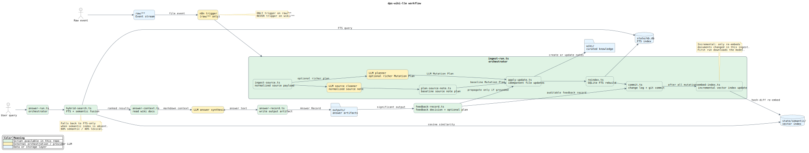

<div align="center">
  
  <h1>dps-wiki-llm</h1>
  <p><strong>Deterministic Node.js tooling for a persistent markdown-based knowledge system.</strong></p>
  <p><code>raw/</code> for events, <code>wiki/</code> for curated state, <code>state/</code> for indexes and logs, and <code>outputs/</code> for artifacts.</p>
</div>

## Overview

`dps-wiki-llm` is the local, deterministic tooling layer of a persistent knowledge workflow built around `raw -> wiki -> state -> outputs`.

The repository is responsible for:

- applying controlled markdown updates to a vault
- indexing `wiki/**/*.md` into SQLite FTS
- querying the index for retrieval
- generating maintenance reports
- recording feedback and git-backed change logs

The repository is not the orchestration layer. `n8n`, LLM planning, and answer synthesis are expected to sit around these scripts, not inside them.

## Architecture Boundaries

- `raw/` is the reactive event stream.
- `wiki/` is stable derived state.
- Only trigger automation on `raw/**`.
- Never trigger automation on `wiki/**`.
- Generated answers do not update the wiki directly.
- Feedback evaluation is mandatory; propagation is conditional.

Breaking the `raw/` versus `wiki/` boundary creates loops, noisy state, and non-deterministic behavior.

## Implemented Tooling

The repo now includes the full local toolchain except for raw-event normalization and the external LLM orchestration steps.

| Script | Purpose | Main outputs |
|---|---|---|
| `init-db.ts` | Creates the SQLite schema and FTS tables. | `state/kb.db` |
| `apply-update.ts` | Applies a Mutation Plan to markdown files with idempotency tracking. | `wiki/**`, `INDEX.md`, `state/runtime/idempotency-keys.json` |
| `feedback-record.ts` | Writes feedback records and can derive a follow-up mutation plan. | `state/feedback/**` |
| `reindex.ts` | Rebuilds the `docs` table and FTS index from `wiki/**/*.md`. | `state/kb.db` |
| `search.ts` | Runs FTS queries and returns ranked results as JSON. | stdout JSON |
| `lint.ts` | Performs structural wiki checks. | `state/maintenance/*-lint.{json,md}` |
| `health-check.ts` | Performs deeper semantic and traceability checks. | `state/maintenance/*-health-check.{json,md}` |
| `commit.ts` | Stages material paths, writes a structured change log, and creates a git commit. | `state/change-log/**`, git commit |

Main gaps relative to the target architecture:

- `ingest-source.ts` is not present yet
- LLM planner and answer-synthesis steps are external to this codebase

## Code Documentation

Detailed English documentation for every script and shared library module lives in [`docs/code-reference.md`](docs/code-reference.md).

## Repository Structure

```text
.
├── README.md
├── package.json
├── tsconfig.json
├── docs/
│   ├── code-reference.md
│   ├── assets/
│   │   └── logo.svg
│   └── diagrams/
│       ├── workflow.puml
│       └── workflow.svg
└── tools/
    ├── init-db.ts
    ├── apply-update.ts
    ├── feedback-record.ts
    ├── reindex.ts
    ├── search.ts
    ├── lint.ts
    ├── health-check.ts
    ├── commit.ts
    ├── config.ts
    └── lib/
```

Expected vault layout:

```text
vault/
├── raw/
├── wiki/
├── state/
└── outputs/
```

## Workflow

The diagram below summarizes the intended workflow. Green nodes are scripts already present in this repo; yellow nodes are planned or external components.

Rendered using the official PlantUML web service:



Canonical source: [`docs/diagrams/workflow.puml`](docs/diagrams/workflow.puml)  
Versioned render: [`docs/diagrams/workflow.svg`](docs/diagrams/workflow.svg)

## Typical Usage

Requirements:

- Node.js `>=22.5.0`, for built-in `node:sqlite` support
- dependencies installed with `npm install`
- Git configured with `user.name` and `user.email` if you plan to use `commit.ts`

The tools are TypeScript source files compiled to `dist/` and executed from the generated JavaScript in the package scripts. `npm install` runs the build through `prepare`; run `npm run build` again after changing source. Use `--silent` when command output must remain parseable JSON for automation.

Check the TypeScript build:

```bash
npm run typecheck
```

Initialize the database:

```bash
npm run --silent init-db -- --vault /path/to/vault
```

Apply a mutation plan:

```bash
npm run --silent apply-update -- --vault /path/to/vault --input ./plan.json
```

Rebuild the search index:

```bash
npm run --silent reindex -- --vault /path/to/vault
```

Run a search query:

```bash
npm run --silent search -- --vault /path/to/vault "model context protocol" --limit 5
```

Record feedback:

```bash
npm run --silent feedback-record -- --vault /path/to/vault --input ./feedback.json
```

Run maintenance checks without writing reports:

```bash
npm run --silent lint -- --vault /path/to/vault --no-write
npm run --silent health-check -- --vault /path/to/vault --no-write
```

Create a structured commit:

```bash
npm run --silent commit -- --vault /path/to/vault --input ./commit.json
```

## CLI Conventions

- `--vault` is the root of the target vault and defaults to the current working directory.
- `--input` is used by JSON-driven scripts such as `apply-update.ts`, `feedback-record.ts`, and `commit.ts`.
- `--db` can override the database path for `init-db.ts`, `reindex.ts`, and `search.ts`.
- `--limit` controls result count in `search.ts`.
- `--no-write` is supported by `feedback-record.ts`, `lint.ts`, and `health-check.ts`.
- Scripts emit machine-readable JSON on success.

## Configuration

`tools/config.ts` is the central behavior configuration for the toolchain. It defines vault paths, default search limits, SQLite schema and pragmas, valid mutation and feedback values, note lint thresholds, health-check thresholds, markdown section behavior, and report directories.

The canonical JSON payload contracts from `AGENTS.md` are represented as TypeScript interfaces in `tools/lib/contracts.ts`.

## Operational Notes

- `apply-update.ts` enforces `create`, `update`, and `noop` actions and tracks idempotency keys in `state/runtime/idempotency-keys.json`.
- `reindex.ts` indexes markdown derived from `wiki/`, not `raw/`.
- `search.ts` queries the FTS index and returns ranked results with `path`, `title`, `doc_type`, and `score`.
- `lint.ts` focuses on structure and maintainability.
- `health-check.ts` focuses on unsupported claims, stale low-confidence notes, and missing pages.
- `commit.ts` writes a change log to `state/change-log/` before creating the git commit.
- `docs/code-reference.md` is the file-level reference for the entire codebase.
