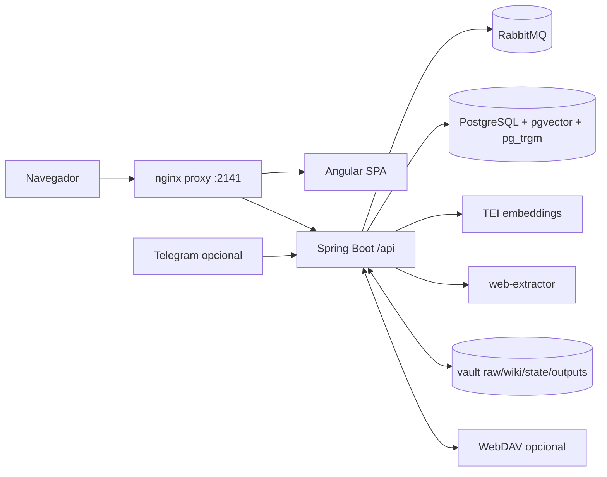

<div align="center">
  
  <h1>dps-wiki-llm</h1>
  <p><strong>Pipeline self-hosted de conocimiento persistente con Spring Boot, Angular, RabbitMQ, PostgreSQL/pgvector, TEI y LLM OpenAI-compatible.</strong></p>
</div>

## Resumen

`dps-wiki-llm` convierte entradas crudas en notas markdown duraderas e indexadas. El sistema separa estrictamente:

```text
raw/**  = eventos de entrada
wiki/** = conocimiento curado y derivado
```

No es un chatbot con memoria libre: es una pipeline determinista de mantenimiento de conocimiento con ingesta, normalizacion LLM, guardrails, revision guiada, busqueda semantica y snapshots reversibles.

Documentacion completa: [docs/README.md](docs/README.md).

## Caracteristicas principales

- Ingesta de URL, Markdown, PDF y texto pegado.
- Extraccion web con Chromium real, Readability/Turndown, PDF, YouTube y PubMed/PMC.
- Source notes bajo `wiki/sources/**`.
- Creacion/asociacion de conceptos con guardrails y deduplicacion semantica.
- Prohibicion de creacion automatica de `wiki/topics/**`.
- Respuestas y chat con recuperacion semantica sobre pgvector.
- UI Angular autenticada con jobs, ingesta, chat, revision, explorador, grafo, historial y settings.
- JWT con TOTP opcional.
- Prompts editables en base de datos.
- Snapshots por archivo, diffs, versiones y reversión de jobs.
- WebDAV opcional para replica externa del vault.
- Telegram long polling opcional.

## Arquitectura resumida


```mermaid
flowchart LR
  browser[Navegador] --> proxy[nginx proxy :2141]
  proxy --> frontend[Angular SPA]
  proxy --> backend[Spring Boot /api]
  telegram[Telegram opcional] --> backend
  backend --> rabbit[(RabbitMQ)]
  backend --> postgres[(PostgreSQL + pgvector + pg_trgm)]
  backend --> tei[TEI embeddings]
  backend --> extractor[web-extractor]
  backend <--> vault[(vault raw/wiki/state/outputs)]
  backend <--> webdav[WebDAV opcional]
```

Mas detalle:

- [Arquitectura](docs/02-architecture/architecture-overview.md)
- [IA y embeddings](docs/03-ai/ai-architecture.md)
- [Modelo de datos](docs/04-data/data-model.md)
- [API](docs/05-api/endpoints.md)
- [Operaciones](docs/08-operations/local-development.md)
- [ADRs](docs/10-decisions/README.md)

## Requisitos

- Docker Compose para el stack completo.
- Java 21 y Maven para backend local.
- Node/pnpm para frontend local.
- Node >=20 para `web-extractor` local.
- `pandoc` y `weasyprint` si se usa exportacion PDF con backend fuera del contenedor.

## Instalacion y ejecucion

Stack completo:

```bash
cp .env.sample .env
docker compose up --build
```

URLs con el compose actual:

- Aplicacion: `http://localhost:2141`
- Backend directo: `http://localhost:8090/api`
- OpenAPI UI: `http://localhost:8090/api/swagger-ui.html`
- Actuator health: `http://localhost:8090/api/actuator/health`
- RabbitMQ management: `http://localhost:15672`

## Desarrollo local

Servicios auxiliares:

```bash
docker compose up -d postgres rabbitmq embeddings web-extractor
```

Backend:

```bash
cd backend
mvn spring-boot:run -Dspring-boot.run.jvmArguments="-Dspring.docker.compose.enabled=false -Dspring.profiles.active=local"
```

Frontend:

```bash
cd frontend
pnpm install
pnpm start
```

Web-extractor:

```bash
cd web-extractor
npm install
npm start
```

## Configuracion

Copiar `.env.sample` a `.env` y revisar como minimo:

| Variable | Uso |
|---|---|
| `LLM_BASE_URL`, `LLM_MODEL`, `LLM_API_KEY` | Proveedor chat OpenAI-compatible. |
| `EMBED_BASE_URL`, `EMBED_MODEL`, `EMBED_DIMENSION` | Sidecar TEI y dimension pgvector. |
| `JWT_SECRET` | Secreto base64 estable, minimo 32 bytes decodificados. |
| `ADMIN_USERNAME`, `ADMIN_PASSWORD` | Usuario admin inicial. |
| `VAULT_PATH` | Root del vault en backend. |
| `WEBDAV_URL`, `WEBDAV_USERNAME`, `WEBDAV_PASSWORD` | Replica WebDAV opcional. |
| `TELEGRAM_BOT_TOKEN`, `TELEGRAM_ALLOWED_CHAT_ID` | Bot Telegram opcional. |

Referencia completa: [docs/08-operations/configuration.md](docs/08-operations/configuration.md).

## Pruebas

Backend:

```bash
cd backend
mvn test
```

Frontend:

```bash
cd frontend
pnpm lint
pnpm build
pnpm test
```

Web-extractor:

```bash
cd web-extractor
npm test
```

Mas detalle: [docs/09-testing/testing-strategy.md](docs/09-testing/testing-strategy.md).

## Estructura del repositorio

```text
backend/        Spring Boot API, servicios, repositorios y migraciones Flyway
frontend/       Angular SPA
web-extractor/  Fastify + Playwright extractor
docker/         nginx proxy
docs/           documentacion tecnica y arquitectonica
openspec/       especificaciones y cambios historicos
vault/          vault de ejemplo/desarrollo
```

## Estado del proyecto

El sistema esta implementado como aplicacion self-hosted con Docker Compose. No se detecta CI/CD versionado en el checkout actual. Algunas capacidades de mantenimiento son endpoints manuales, no jobs programados.

## Limitaciones conocidas

- Las respuestas dependen de embeddings; no hay fallback lexical automatico en `AnswerPipelineService`.
- No hay evaluacion automatica de calidad LLM/retrieval.
- No se detectan tests frontend `*.spec.ts`.
- Cambiar `EMBED_DIMENSION` requiere coordinacion con migraciones/indice.
- Defaults de desarrollo no son seguros para produccion.

Ver [riesgos conocidos](docs/11-quality/known-risks.md) y [preguntas abiertas](docs/open-questions.md).

