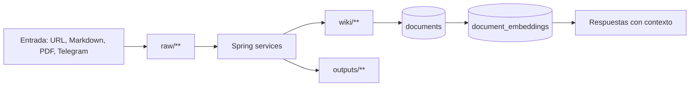

# Resumen de arquitectura

El sistema sigue una arquitectura de contenedores cooperantes:

- Angular 21 sirve la experiencia de usuario.
- nginx publica la SPA y proxifica `/api/**`.
- Spring Boot expone la API bajo contexto `/api`, autentica usuarios, encola trabajos y ejecuta pipelines.
- RabbitMQ separa trabajos de escritura y respuesta.
- PostgreSQL guarda usuarios, jobs, prompts, snapshots, indice documental y embeddings vectoriales.
- TEI genera embeddings de texto.
- `web-extractor` convierte URLs y ficheros a markdown usando browser rendering o parsers especializados.
- El vault en disco conserva el estado legible por humanos.

## Estrategia de solucion

El diseno prioriza estado explicito sobre memoria opaca:

## Restricciones

| Restriccion | Impacto |
|---|---|
| Solo `raw/**` dispara ingesta | Evita bucles de auto-ingesta desde `wiki/**`. |
| No crear `wiki/topics/**` por automatizacion | Los temas siguen siendo curacion humana. |
| Context path `/api` | Los controladores declaran rutas relativas sin prefijo `/api`. |
| Un consumidor por cola con `prefetch=1` | Serializa trabajos y reduce carreras en escrituras del vault. |
| Embeddings de dimension configurable por Flyway placeholder | `EMBED_DIMENSION` debe coincidir con la columna `vector(${embed_dimension})`. |
| JWT stateless | No hay sesiones HTTP server-side. |

Fuente: `AGENTS.md`, `backend/src/main/resources/application.yml`, `RabbitConfig.java`, `MutationApplier.java`, `V3__document_embeddings.sql`.

## Vistas arc42 cubiertas

| Vista arc42 | Documento |
|---|---|
| Introduccion y objetivos | [Vision](../01-introduction/project-overview.md), [Objetivos](../01-introduction/goals-and-scope.md) |
| Restricciones | Este documento y [Conceptos transversales](cross-cutting-concepts.md) |
| Contexto y alcance | [Contexto del sistema](system-context.md) |
| Estrategia de solucion | Este documento |
| Vista de bloques | [Contenedores](containers.md), [Componentes](components.md) |
| Vista de ejecucion | [Flujos de ejecucion](runtime-flows.md) |
| Vista de despliegue | [Despliegue tecnico](deployment.md) |
| Conceptos transversales | [Conceptos transversales](cross-cutting-concepts.md) |
| Decisiones | [ADRs](../10-decisions/README.md) |
| Calidad, riesgos y deuda | [Calidad](../11-quality/quality-attributes.md), [Riesgos](../11-quality/known-risks.md), [Deuda](../11-quality/technical-debt.md) |
| Glosario | [Glosario](../01-introduction/glossary.md) |

