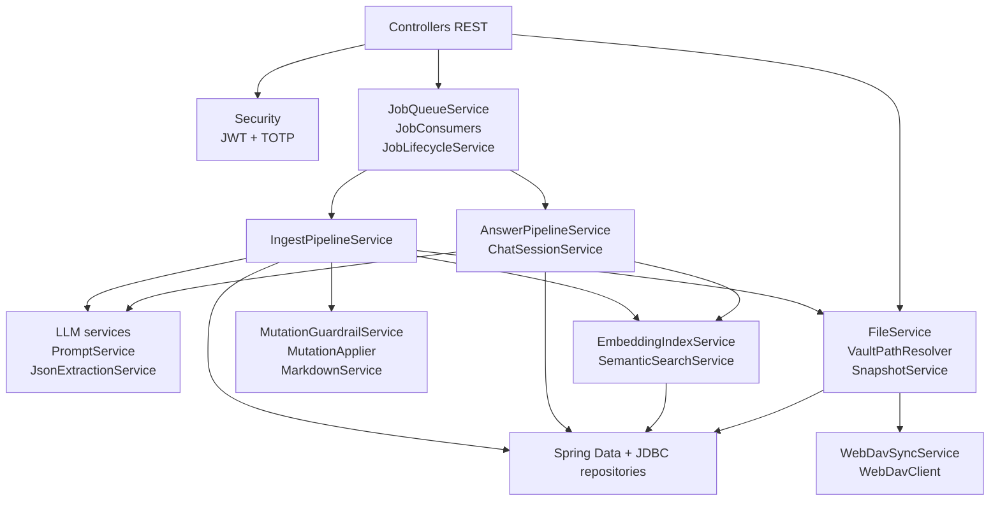

# Componentes principales

## Backend

| Area | Componentes | Responsabilidad |
|---|---|---|
| API | `controllers/*Controller.java` | Rutas HTTP, validacion superficial y delegacion a servicios. |
| Seguridad | `SecurityConfig`, `JwtAuthFilter`, `JwtUtil`, `TotpService` | JWT, 2FA, roles y excepciones 401. |
| Jobs | `JobQueueService`, `JobConsumers`, `JobLifecycleService`, `JobEventService`, `HealthCheckJobHandler` | Persistencia, encolado, consumo y SSE de estado. |
| Ingesta | `RawIntakeService`, `SourceNormalizer`, `IngestPipelineService` | Entrada cruda, normalizacion y pipeline de escritura. |
| IA | `OpenAiCompatibleLlmClient`, `SourceNoteLlmService`, `LlmMutationPlanService`, `KeywordGenerationService` | Llamadas LLM, prompts, parsing y generacion de contenido estructurado. |
| Busqueda | `ReindexService`, `EmbeddingIndexService`, `SemanticSearchService`, `FileLookupService` | Indice de documentos, embeddings y busqueda. |
| Mutaciones | `MutationGuardrailService`, `MutationApplier`, `MarkdownService` | Validar, fusionar y renderizar notas markdown. |
| Vault | `FileService`, `SnapshotService`, `RootIndexService` | Edicion, snapshots, versiones, PDF e indice raiz. |
| Sincronizacion | `WebDavSyncService`, `WebDavClient` | Replicacion opcional y conflictos WebDAV. |

## Frontend

| Area | Componentes |
|---|---|
| Bootstrap/routing | `frontend/src/main.ts`, `AppComponent`, `NavComponent` |
| Autenticacion | `AuthService`, `authInterceptor`, `authGuard`, `LoginComponent`, `ProfileComponent` |
| Operacion de jobs | `JobsStore`, `JobsViewerComponent`, `IngestComponent`, `ReviewComponent` |
| Chat | `ChatComponent`, `ChatSessionService` |
| Vault | `ExplorerComponent`, `FileService`, plugins Milkdown |
| Historial/sync | `GitHistoryComponent`, `ConflictMergeEditorComponent` |
| Grafo | `GraphViewComponent`, `GraphSettingsComponent` |
| Configuracion | `SettingsComponent`, modales de keywords, health-check parcial, dedup y enlaces rotos |

Fuente: `backend/src/main/java/com/dpswikillm/**`, `frontend/src/app/**`.
