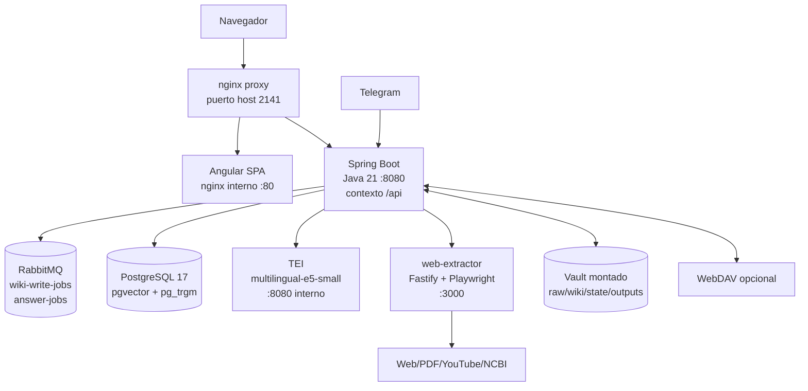

# Contenedores

## Diagrama C4 - Contenedores

## Servicios de Docker Compose

| Servicio | Imagen/build | Puertos host | Responsabilidad |
|---|---|---|---|
| `postgres` | `pgvector/pgvector:pg17` | `5432` en override | Persistencia relacional, `pg_trgm`, `pgvector`. |
| `rabbitmq` | `rabbitmq:3.13-management` | `15672`, `5672` en override | Colas de trabajos y UI de gestion. |
| `embeddings` | `ghcr.io/huggingface/text-embeddings-inference:cpu-1.7` | `8080` en override | Embeddings `intfloat/multilingual-e5-small`. |
| `web-extractor` | build local `./web-extractor` | `3000` en override | Extraccion de URL/ficheros a markdown. |
| `backend` | build local `./backend` | `8090:8080` en override | API y pipelines. |
| `frontend` | build local `./frontend` | interno | SPA estatica. |
| `proxy` | `nginx:1.27-alpine` | `2141:80` | Entrada principal. |

Fuente: `docker-compose.yml`, `docker-compose.override.yml`, `docker/nginx.conf`.

