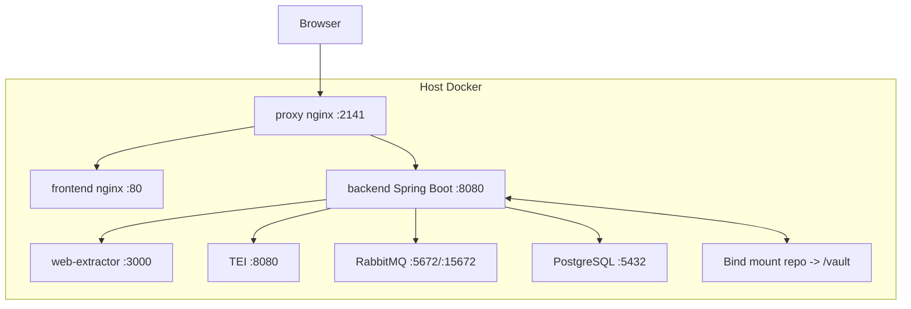

# Despliegue tecnico

## Vista de despliegue

## Nginx

El proxy raiz enruta:

- `/api/jobs/events` hacia backend con `proxy_buffering off` y timeouts de una hora para SSE.
- `/api/` hacia backend.
- `/` hacia el frontend.

Fuente: `docker/nginx.conf`.

## Imagen backend

La imagen backend compila con Maven sobre `maven:3.9.9-eclipse-temurin-21` y ejecuta con `eclipse-temurin:21-jre`. Instala `git`, `pandoc`, `weasyprint` y `wget`; `pandoc` y `weasyprint` se usan para exportacion PDF.

Fuente: `backend/Dockerfile`, `FileService.exportPdf`.

## Imagen frontend

La imagen frontend usa Node 24 Alpine, `pnpm build` y sirve `dist/dps-wiki-llm-frontend/browser` con nginx.

Fuente: `frontend/Dockerfile`, `frontend/angular.json`.

## Imagen web-extractor

Parte de `mcr.microsoft.com/playwright:v1.47.2-jammy`, actualiza Node a 22 e instala `yt-dlp[default]` con `curl_cffi`. Esto soporta extraccion browser-rendered, PDF y YouTube.

Fuente: `web-extractor/Dockerfile`, `web-extractor/src/server.js`.

