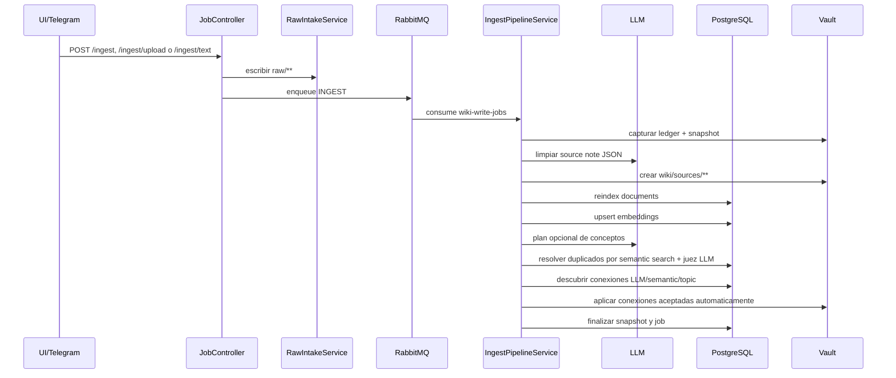
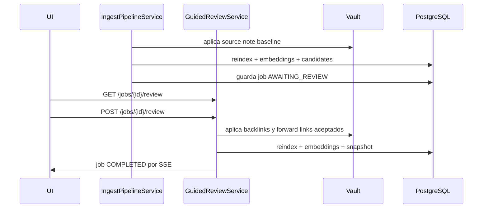
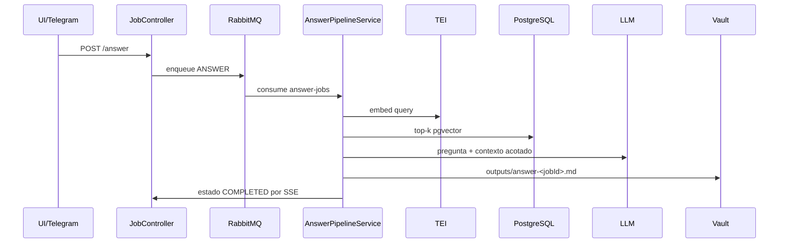
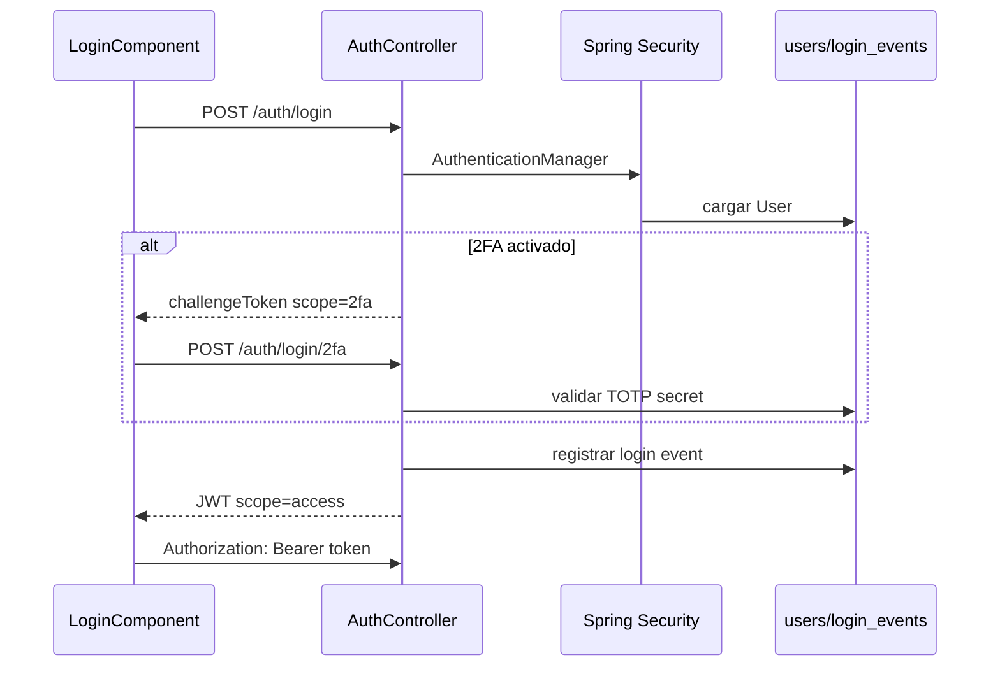
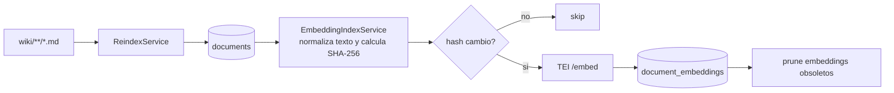
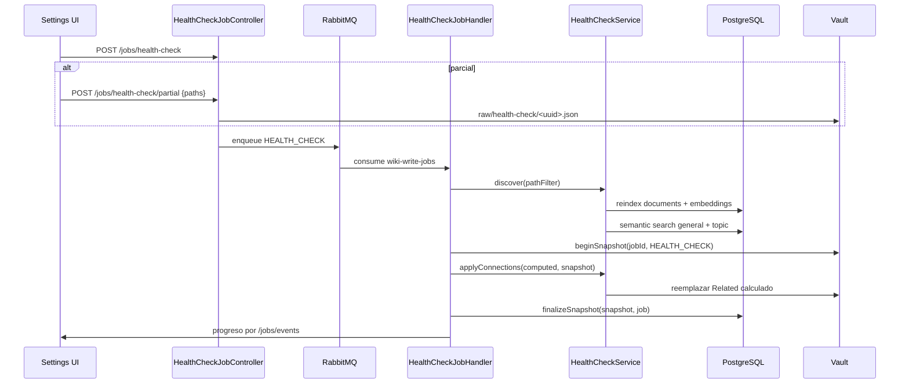
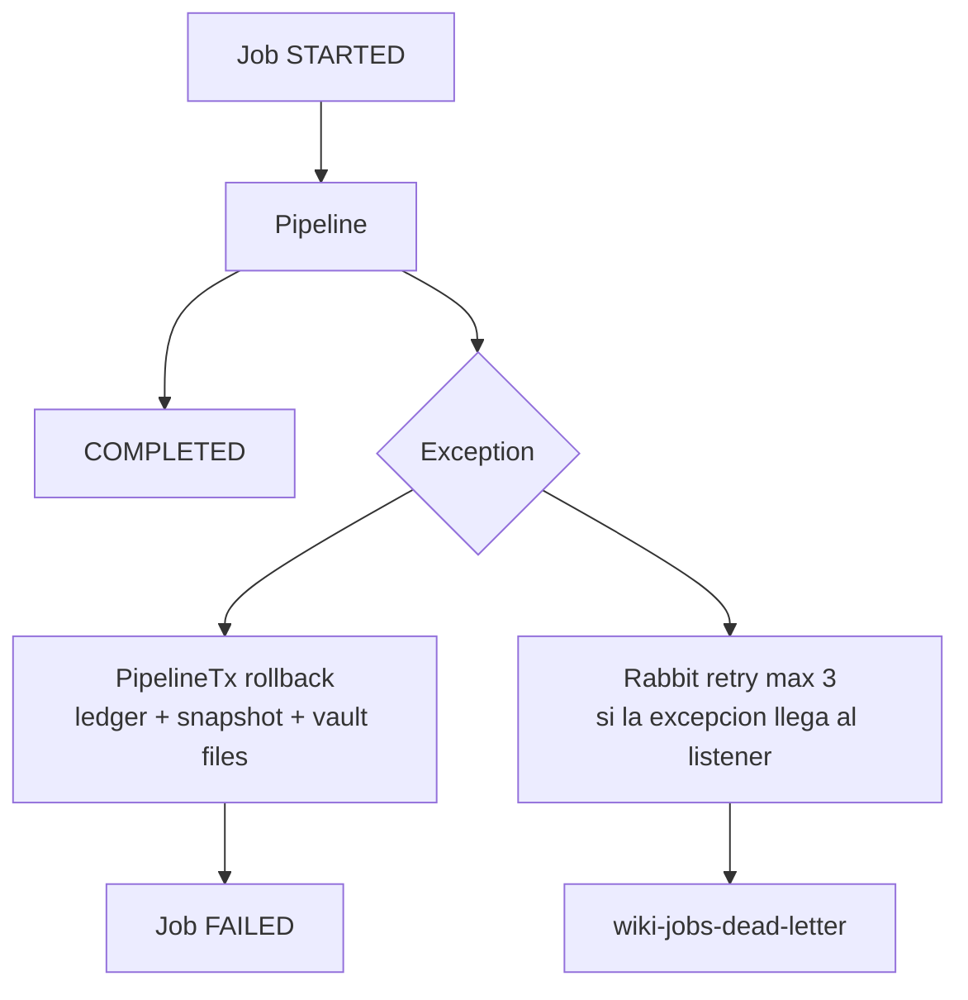

# Flujos de ejecucion

## Ingesta desatendida

Fuente: `IngestPipelineService.java`, `RawIntakeService.java`, `SourceNoteLlmService.java`, `ConnectionDiscoveryService.java`.

## Ingesta validada

## Respuesta

## Autenticacion

## Reindex y embeddings

## Health Check como job

El endpoint anterior `GET /api/settings/health-check` fue reemplazado por endpoints `POST` bajo `/api/jobs/**`. El frontend solo encola el trabajo y delega el seguimiento al panel global de jobs.

Fuente: `HealthCheckJobController.java`, `HealthCheckJobHandler.java`, `HealthCheckService.java`, `JobConsumers.java`, `frontend/src/app/components/settings.component.ts`, `frontend/src/app/components/health-check-selection-modal.component.ts`.

## Manejo de errores en jobs

Nota: `JobConsumers` captura excepciones y marca el job como `FAILED`; el interceptor Rabbit aplica reintentos cuando una excepcion sale del listener.

Fuente: `JobConsumers.java`, `RabbitConfig.java`, `PipelineTx.java`, `SnapshotService.java`.
