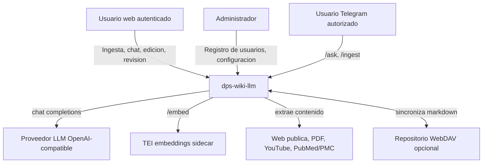

# Contexto del sistema

## Diagrama C4 - Contexto

## Limites externos

| Externo | Contrato observado |
|---|---|
| LLM OpenAI-compatible | `POST /chat/completions` con `model`, `messages` y opcional `response_format`. |
| TEI | `POST /embed` con `inputs`, `truncate: true`, `normalize: true`. |
| Telegram Bot API | `sendMessage` y long polling a traves de `telegrambots-springboot-longpolling-starter`. |
| WebDAV | `PROPFIND`, `GET`, `PUT`, `DELETE`, `MOVE` encapsulados en `WebDavClient`. |
| Web | `web-extractor` navega URLs HTTP(S), detecta PDF/YouTube/NCBI y devuelve markdown. |

Fuente: `OpenAiCompatibleLlmClient.java`, `OpenAiCompatibleEmbeddingClient.java`, `WikiBotService.java`, `WebDavSyncService.java`, `web-extractor/src/server.js`.

