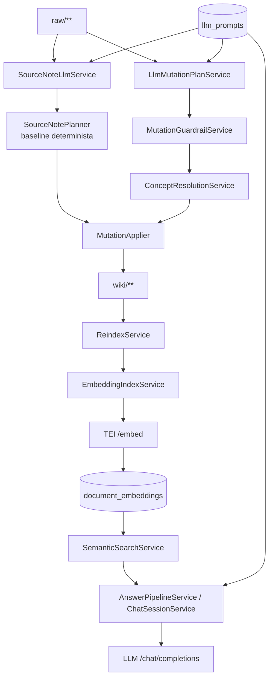

# Arquitectura de IA

El sistema usa IA para transformar, enlazar, deduplicar y responder, pero no deja que el modelo escriba directamente en el vault. Todas las salidas LLM pasan por servicios de parseo, validacion o planes de mutacion.

## Modelos y proveedores

| Uso | Cliente | Modelo/configuracion | Proveedor |
|---|---|---|---|
| Chat/completions | `OpenAiCompatibleLlmClient` | `app.llm.model` / `LLM_MODEL`, default `gpt-oss` | Cualquier endpoint OpenAI-compatible |
| Embeddings | `OpenAiCompatibleEmbeddingClient` | `app.embeddings.model` / `EMBED_MODEL`, default `multilingual-e5-small` | TEI sidecar |
| Embeddings en Compose | servicio `embeddings` | `intfloat/multilingual-e5-small`, 384 dimensiones por defecto | Hugging Face TEI CPU |

Fuente: `application.yml`, `docker-compose.yml`, `OpenAiCompatibleLlmClient.java`, `OpenAiCompatibleEmbeddingClient.java`.

## Responsabilidades de IA

| Servicio | Entrada | Salida | Validacion |
|---|---|---|---|
| `SourceNoteLlmService` | `NormalizedSourcePayload.content` | `LlmSourceNote` con summary, raw_context, claims, open_questions, keywords | JSON object con `summary`, `raw_context` y `keywords` no vacios |
| `LlmMutationPlanService` | raw path, source note path y contenido | `MutationPlan` | JSON object con `plan_id` y `page_actions` array |
| `ConceptResolutionService` | conceptos propuestos + candidatos semanticos | create original o update a concepto existente | Timeout 5s; si falla, conserva create original |
| `ConceptDedupScanService` | lista de slugs/titulos de conceptos | grupos de duplicados | Solo slugs existentes; grupos de 2+ |
| `KeywordGenerationService` | `Summary` o cuerpo filtrado | lista de keywords | JSON object con `keywords` no vacio y normalizacion mecanica |
| `LinkExplainService` | nota origen + nota destino truncadas | texto de explicacion | Sin parsing estructurado; max 3000 chars por nota |
| `AnswerPipelineService` | pregunta + contexto semantico | respuesta markdown/texto | Prompt exige contestar desde contexto, pero no hay verificador automatico |

## Control anti-alucinaciones

Mecanismos existentes:

- prompts piden JSON estricto y no inventar hechos;
- parsing extrae el objeto JSON y valida campos obligatorios;
- `MutationGuardrailService` bloquea rutas, topics automaticos y acciones sin fuente;
- `AnswerPipelineService` limita el contexto a documentos recuperados y pide citar documentos usados;
- los conceptos propuestos pueden pasar por busqueda semantica y juez conservador.

Limitaciones:

- No hay evaluacion automatica de veracidad de respuestas.
- No hay trazado token/coste persistido.
- `LlmMutationPlanService` registra prompts y respuesta LLM a nivel `info`; esto puede exponer contenido sensible en logs si se opera con fuentes privadas.

Fuente: `SourceNoteLlmService.java`, `JsonExtractionService.java`, `MutationGuardrailService.java`, `AnswerPipelineService.java`, `LlmMutationPlanService.java`.

