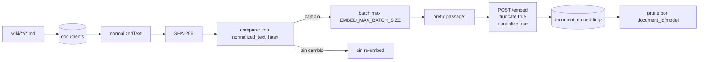

# Pipeline de embeddings

## Flujo



## Normalizacion usada para embeddings

`EmbeddingIndexService.normalizedText` prioriza frontmatter `keywords` cuando existe:

```text
title + " " + keywords
```

Si no hay keywords:

```text
title + "\n" + body
```

Despues colapsa whitespace. Esta decision hace que las keywords influyan fuertemente en la vecindad semantica.

## Contrato con TEI

| Campo | Valor |
|---|---|
| Endpoint | `POST {EMBED_BASE_URL}/embed` |
| Input passages | `passage: <texto normalizado>` |
| Input query | `query: <pregunta>` |
| Truncado local | 2000 caracteres |
| Truncado TEI | `truncate: true` |
| Normalizacion vectorial | `normalize: true` |
| Batch | `EMBED_MAX_BATCH_SIZE`, default `8` |

Fuente: `OpenAiCompatibleEmbeddingClient.java`, `EmbeddingIndexService.java`.

## Almacenamiento

La tabla `document_embeddings` guarda un vector por `(document_id, model)`:

- `embedding vector(${embed_dimension})`;
- `dimension`;
- `normalized_text_hash`;
- `embedded_at`.

El indice HNSW usa `vector_cosine_ops`.

Fuente: `V3__document_embeddings.sql`, `JdbcDocumentIndexRepository.java`.

