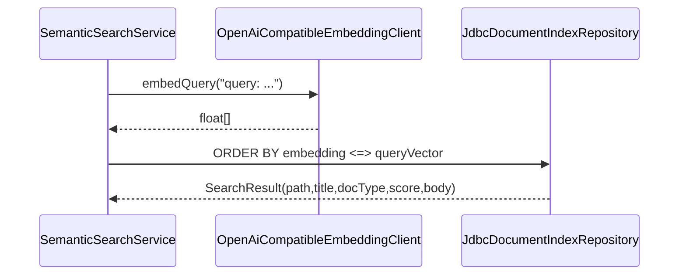

# Busqueda semantica

La busqueda semantica actual es el mecanismo usado por respuestas, chat, discovery de enlaces, resolucion de conceptos y health-check.

## Consulta



## Ranking

`JdbcDocumentIndexRepository` ordena por distancia coseno pgvector:

```sql
ORDER BY e.embedding <=> ?::vector
```

El score expuesto es:

```text
1 - cosine_distance
```

No hay umbral global para respuestas; `AnswerPipelineService` pide top 5. Otros flujos aplican umbrales:

| Flujo | Limite | Umbral |
|---|---:|---:|
| `AnswerPipelineService` | 5 | ninguno |
| `ChatSessionService` | 5 | ninguno |
| `ConnectionDiscoveryService` general | 8 | 0.72 |
| `ConnectionDiscoveryService` topics | 3 | 0.72 |
| `LinkDiscoveryService` | 10 | 0.72 (solo pre-filtro grueso; ver CSLS abajo) |
| `HealthCheckService` general | 8 | 0.72 |
| `ConceptResolutionService` | 3 conceptos | `concept.similarity-threshold`, default 0.82 |
| `ConceptDedupScanService` | batch LLM sobre conceptos | `concept.dedup-similarity-threshold` existe, pero el scan actual llama al juez batch sobre todos los conceptos y solo usa embeddings para warnings |

Fuente: `SemanticSearchService.java`, `JdbcDocumentIndexRepository.java`, `AnswerPipelineService.java`, `ConnectionDiscoveryService.java`, `HealthCheckService.java`, `ConceptResolutionService.java`, `ConceptDedupScanService.java`, `V27__concept_similarity_threshold.sql`, `V32__concept_dedup_judge_prompt_and_setting.sql`.

### Ranking de link discovery (CSLS)

`multilingual-e5-small` es anisotropo: notas no relacionadas puntuan ~0.80-0.86, y algunas notas son "hubs" cercanas a todo. Por eso `LinkDiscoveryService` no acepta candidatos por coseno crudo, sino por **CSLS (Cross-domain Similarity Local Scaling)**:

```text
r_k(X)     = coseno medio de X a sus k vecinos mas cercanos (hubness)
CSLS(A,B)  = 2·cos(A,B) − r_k(A) − r_k(B)
aceptar B  si CSLS(A,B) >= link.csls-margin
```

- `r_k(B)` se precalcula por documento y se guarda en `document_embeddings.hubness` (migracion `V39`), recomputado cuando cambia el embedding y podado con su fila. `r_k(A)` se calcula al vuelo con el top-`k` de la propia busqueda.
- El umbral absoluto `link.similarity-threshold` (0.72) solo pre-filtra el pool de candidatos; el gate real es el margen CSLS. Si nada supera el margen, discovery devuelve **cero enlaces** (sin fallback a top-N en crudo).
- Ajustes: `link.hubness-k` (default 10, requiere reindex para recomputar hubness) y `link.csls-margin` (default 0.05, tunable en caliente).
- Diagnostico/calibracion: `GET /links/diagnostics` reporta la distribucion global de similitud (media, p90/p95/p99) y evalua `link-discovery-benchmark.json` (incluye `muscle-hypertrophy ↔ 5-htp3` como negativo canonico) con coseno crudo y CSLS.

Fuente: `LinkDiscoveryService.java`, `LinkRankingSettings.java`, `LinkDiagnosticsService.java`, `EmbeddingIndexService.java`, `V39__document_embeddings_hubness.sql`.

## Busqueda lexical

`FileLookupService` usa `DocumentIndexRepository.lexicalLookup`, implementado con `ILIKE` y `similarity` de `pg_trgm`. Esta busqueda se expone para lookup manual en `/api/files/lookup`; no participa en la respuesta principal.

Fuente: `FileLookupService.java`, `JdbcDocumentIndexRepository.java`, `JobController.lookupFiles`.

