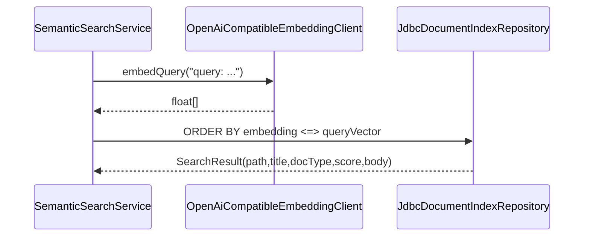

# Busqueda semantica

La busqueda semantica actual es el mecanismo usado por respuestas, chat, discovery de enlaces, resolucion de conceptos y health-check.

## Consulta



## Ranking

`JdbcDocumentIndexRepository` ordena por distancia coseno pgvector:

```sql
ORDER BY e.embedding <=> ?::vector
```

El score expuesto es:

```text
1 - cosine_distance
```

No hay umbral global para respuestas; `AnswerPipelineService` pide top 5. Otros flujos aplican umbrales:

| Flujo | Limite | Umbral |
|---|---:|---:|
| `AnswerPipelineService` | 5 | ninguno |
| `ChatSessionService` | 5 | ninguno |
| `ConnectionDiscoveryService` general | 8 | 0.72 |
| `ConnectionDiscoveryService` topics | 3 | 0.72 |
| `LinkDiscoveryService` | 10 | 0.72 |
| `HealthCheckService` general | 8 | 0.72 |
| `ConceptResolutionService` | 3 conceptos | `concept.similarity-threshold`, default 0.82 |
| `ConceptDedupScanService` | batch LLM sobre conceptos | `concept.dedup-similarity-threshold` existe, pero el scan actual llama al juez batch sobre todos los conceptos y solo usa embeddings para warnings |

Fuente: `SemanticSearchService.java`, `JdbcDocumentIndexRepository.java`, `AnswerPipelineService.java`, `ConnectionDiscoveryService.java`, `HealthCheckService.java`, `ConceptResolutionService.java`, `ConceptDedupScanService.java`, `V27__concept_similarity_threshold.sql`, `V32__concept_dedup_judge_prompt_and_setting.sql`.

## Busqueda lexical

`FileLookupService` usa `DocumentIndexRepository.lexicalLookup`, implementado con `ILIKE` y `similarity` de `pg_trgm`. Esta busqueda se expone para lookup manual en `/api/files/lookup`; no participa en la respuesta principal.

Fuente: `FileLookupService.java`, `JdbcDocumentIndexRepository.java`, `JobController.lookupFiles`.

