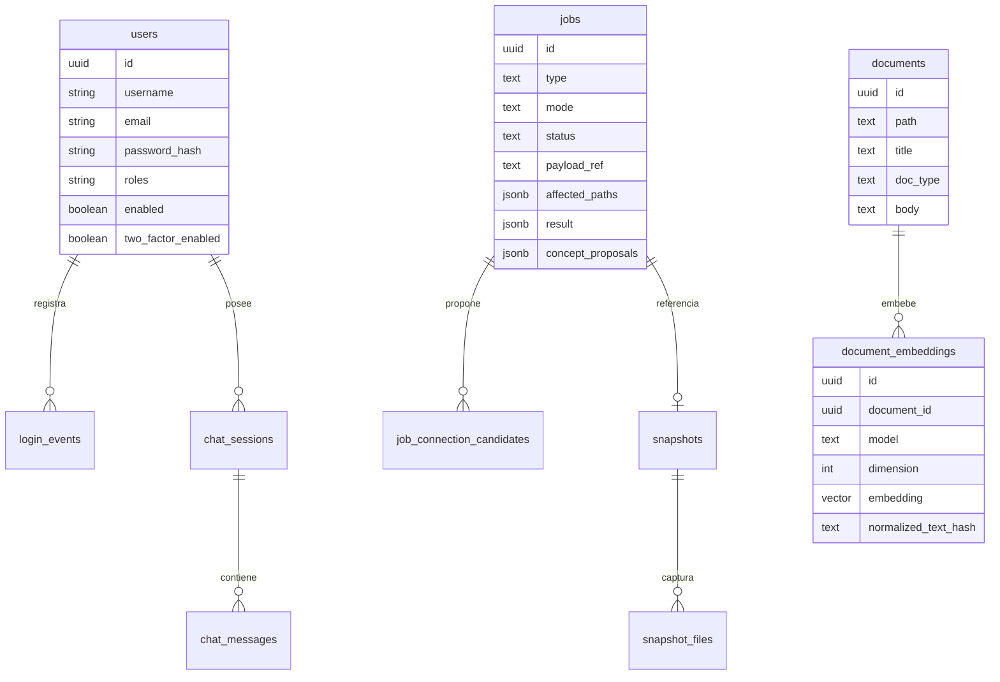

# Modelo de datos

## Vista relacional principal

## Tablas

| Tabla | Responsabilidad |
|---|---|
| `documents` | Indice reconstruible de documentos markdown bajo `wiki/**`. |
| `document_embeddings` | Vector por documento y modelo para busqueda pgvector. |
| `jobs` | Estado, tipo, modo, payload, resultados y snapshot asociado. |
| `operations` | Registro de operaciones de revision/acciones. |
| `job_connection_candidates` | Candidatos de conexion LLM, semantic o topic para revision/aplicacion. |
| `users` | Usuarios Spring Security, roles, password hash y TOTP. |
| `llm_prompts` | Prompts editables por clave. |
| `login_events` | Auditoria de login con IP, pais/ciudad si GeoIP esta disponible. |
| `snapshots` | Agrupacion de cambios por operacion/job. |
| `snapshot_files` | Contenido antes/despues y estadisticas de diff por archivo. |
| `vault_file_sync` | Baseline de sincronizacion WebDAV y conflictos. |
| `app_settings` | Ajustes operativos como `resource-folder` y umbrales. |
| `chat_sessions`, `chat_messages` | Conversaciones persistidas por usuario. |

Fuente: `backend/src/main/resources/db/migration/*.sql`, `backend/src/main/java/com/dpswikillm/domain/*.java`.

