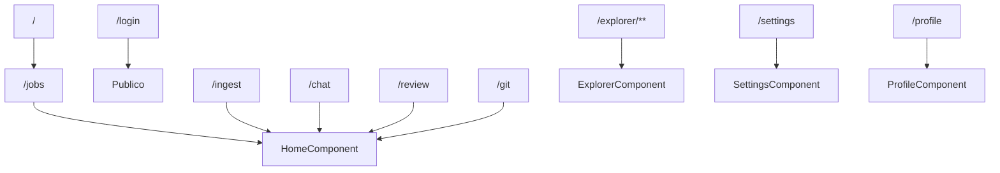

# Routing frontend

Todas las rutas salvo `/login` usan `authGuard`. `ExplorerComponent` tambien usa `unsavedChangesGuard` para evitar perder cambios no guardados.

Fuente: `frontend/src/main.ts`, `frontend/src/app/auth.guard.ts`, `frontend/src/app/unsaved-changes.guard.ts`.

