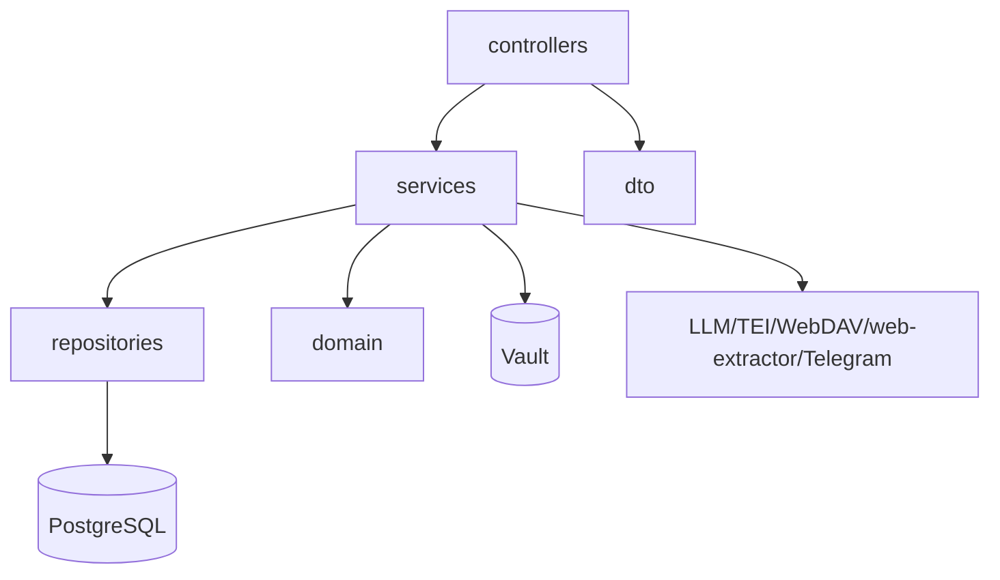

# Arquitectura backend

El backend es una aplicacion Spring Boot 3.3 con Java 21. Usa controladores REST delgados y servicios para la logica de negocio.

## Capas

## Punto de entrada

`DpsWikiLlmApplication` arranca Spring Boot. `application.yml` centraliza datasource, RabbitMQ, LLM, embeddings, extractor, JWT, admin, CORS y WebDAV.

Fuente: `DpsWikiLlmApplication.java`, `application.yml`, `AppProperties.java`.

